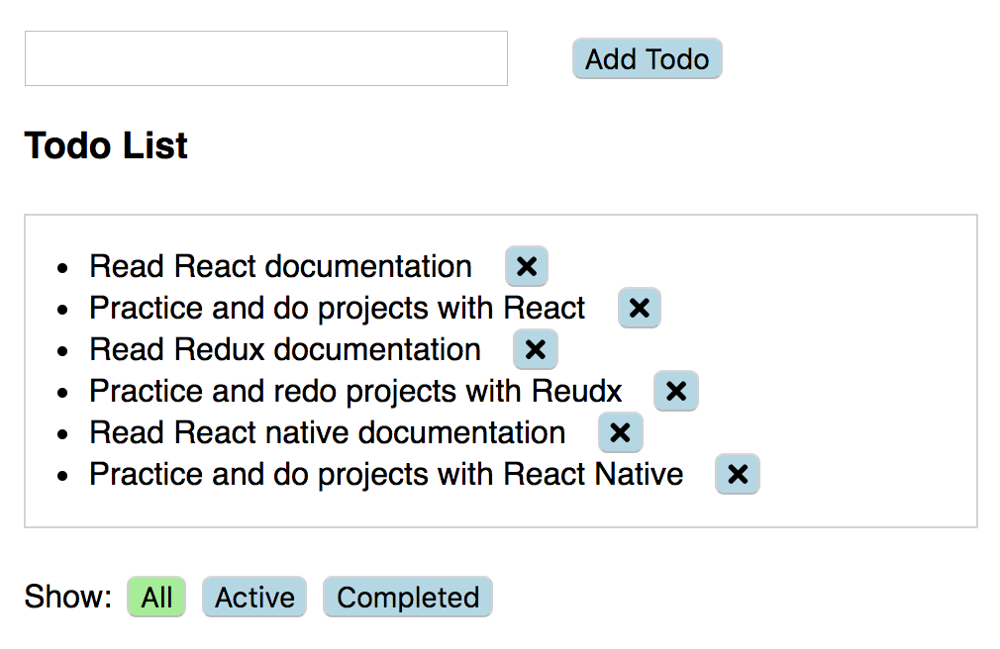

# Todo-list Project

- This project is build with ReactJS and Redux.
- It is a todo list web app.

## App Functionality

Users will be able to 
- add and remove todos
- mark todos completed 
- check the list by all, active or completed

## Project Screenshots

## Installation Instructions
- git clone https://github.com/mavisluan/todo-list.git
- cd todo-list
- yarn install
- yarn start
