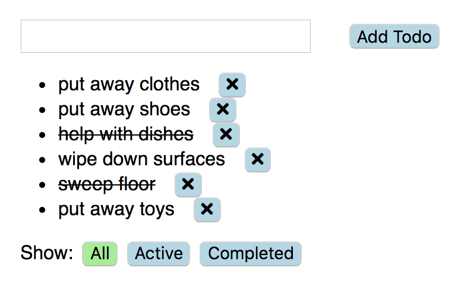

# Todo-list Project

- This project is build with ReactJS and Redux.
- It is a todo list web app.

# App Functionality

Users will be able to 
- add and remove todos
- mark todos completed 
- check the list by all, active or completed

# Project Screenshots

## Todo list by all

## Todo list by active

## Todo list by completed

# Installation Instructions
- clone my repo git clone https://github.com/mavisluan/todo-list.git
- install all project dependencies with yarn install
- start the development server with yarn start